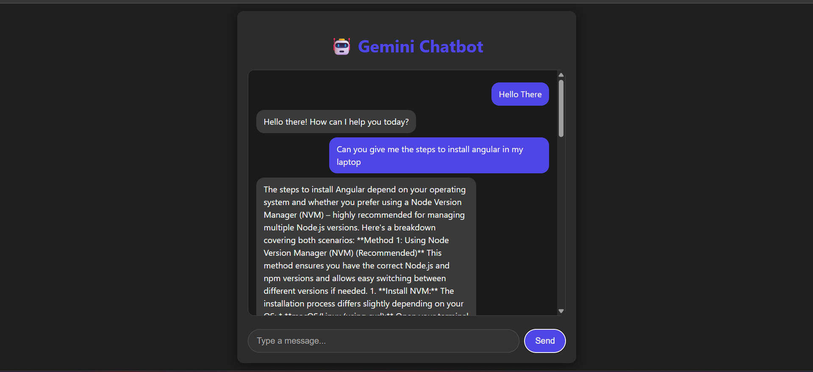

🤖 Gemini AI Chatbot

A modern AI chatbot built using **Google Gemini API**, **FastAPI backend**, and **React frontend**.  
This project showcases a clean, dark-mode chatbot UI with real-time interaction powered by Gemini generative AI.

---

## 🚀 Features

- Chat with AI using **Google Gemini API**.
- **React frontend** with clean dark-mode design.
- **FastAPI backend** to handle API requests securely.
- Responsive chat bubbles for **user** and **AI**.
- Input box with smooth focus animation.
- Easy to run locally and deploy.
- Fully modular project structure.

---

## ⚡ Tech Stack

- **Frontend:** React, Vite, Axios, CSS  
- **Backend:** FastAPI, Uvicorn, Python  
- **AI API:** Google Gemini  
- **Environment:** `.env` for storing API key  

